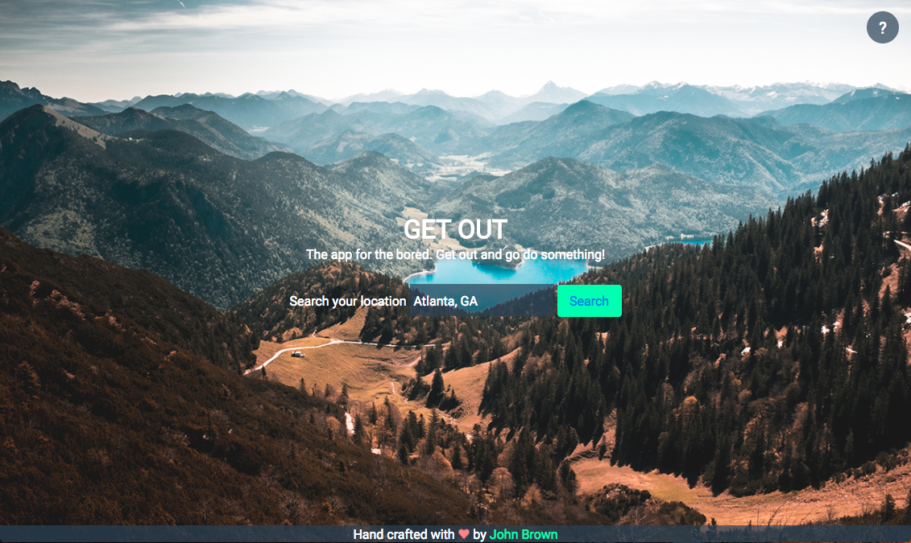

# Get Out

This is an app that was designed for the bored by the bored. The user enters his location and a list of (mostly free) activities are presented near the user. This utilizes Foursquares api.

## Key Features

* Users search by location and are given a list of activities to choose from
* Users can see ratings by Foursquare
* Users can view location of activities on google map

## Credits and Tools
This software uses code from several open source packages.
* HTML5, CSS3, Javascript
* jQuery
* Foursquare's API
